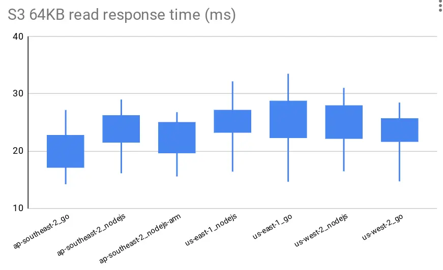

# AWS s3 response time checker

Deploy a lambda function into each region and check lambda -> s3 response time when querying random 64KB chunks from a 10MB file

## Summary



| Env    | Language        | Read Size | Approx duration |
| ------ | --------------- | --------- | --------------- |
| Lambda | NodeJs 128mb    | 64KB      | 100ms           |
| Lambda | NodeJs 256mb    | 64KB      | 60ms            |
| Lambda | NodeJs 512mb    | 64KB      | 30ms            |
| Lambda | NodeJs >=1024mb | 64KB      | 20ms            |
| Lambda | Go >=128mb      | 64KB      | 20ms            |


| Env    | Language              | Read Size | Approx duration |
| ------ | --------------------- | --------- | --------------- |
| Lambda | NodeJs + VPC endpoint | 64KB      | 20ms            |
| Lambda | Go + VPC endpoint     | 64KB      | 20ms            |
| EKS    | NodeJs + VPC Endpoint | 64KB      | 20ms            |

> ARM vs x86 did not make any difference for the response times

Full results [response-times.csv](./response-times.csv)

## Run local

```
export BUCKET_NAME=some-test-bucket
npx tsx src/bin.ts
```

## Deploy

```
npx cdk --app "npx tsx src/cdk.ts" deploy --all
```

## Invoke

```
wget https://......lambda-url.us-east-1.on.aws/
```

Time in MS to read the chunk

```json
{
  "read64k": [
    22.434892, 14.32264, 24.059891, 20.467945, 27.513242, 23.122463, 15.576985,
    21.465589, 16.969314, 16.580614, 14.77986, 23.326269, 26.666152, 22.537266,
    24.27334, 15.16381, 20.492041, 22.825431, 16.427651, 19.703863
  ]
}
```
