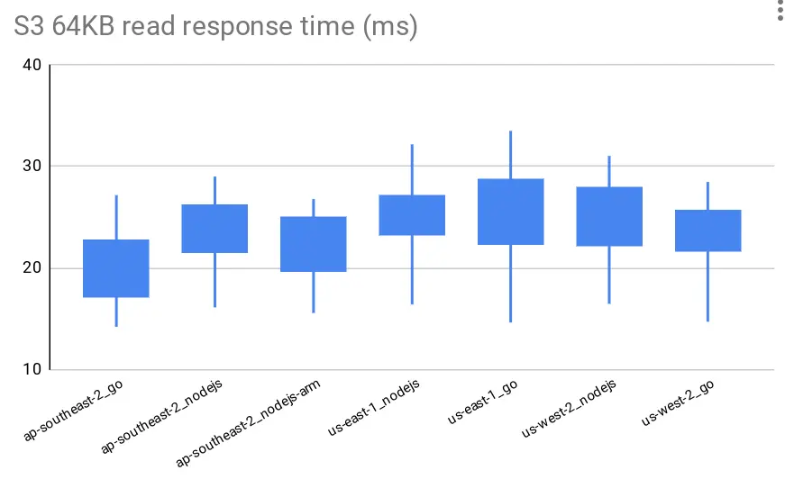
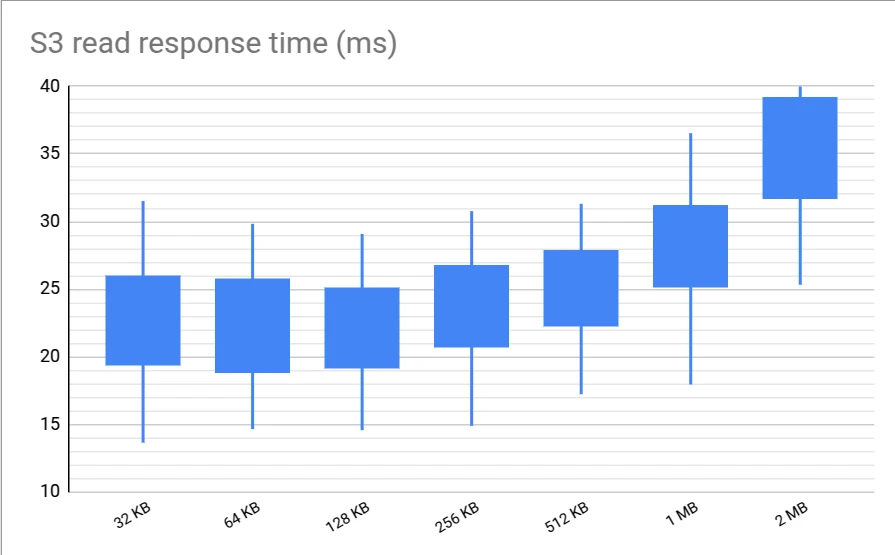

# AWS s3 response time checker

Deploy a lambda function into each region and check lambda -> s3 response time when querying random 64KB chunks from a 10MB file

## Summary



| Env    | Language        | Read Size | Approx duration |
| ------ | --------------- | --------- | --------------- |
| Lambda | NodeJs 128mb    | 64KB      | 100ms           |
| Lambda | NodeJs 256mb    | 64KB      | 60ms            |
| Lambda | NodeJs 512mb    | 64KB      | 30ms            |
| Lambda | NodeJs >=1024mb | 64KB      | 20ms            |
| Lambda | Go >=128mb      | 64KB      | 20ms            |


With VPC Endpoints

| Env    | Language              | Read Size | Approx duration |
| ------ | --------------------- | --------- | --------------- |
| Lambda | NodeJs + VPC endpoint | 64KB      | 20ms            |
| Lambda | Go + VPC endpoint     | 64KB      | 20ms            |
| EKS    | NodeJs + VPC Endpoint | 64KB      | 20ms            |

> ARM vs x86 did not make any difference for the response times



| Env    | Language        | Read Size | Approx duration |
| ------ | --------------- | --------- | --------------- |
| Lambda | NodeJs >=1024mb | 32KB      | 22ms            |
| Lambda | NodeJs >=1024mb | 64KB      | 22ms            |
| Lambda | NodeJs >=1024mb | 128KB     | 22ms            |
| Lambda | NodeJs >=1024mb | 256KB     | 24ms            |
| Lambda | NodeJs >=1024mb | 512KB     | 25ms            |
| Lambda | NodeJs >=1024mb | 1024KB    | 28ms            |
| Lambda | NodeJs >=1024mb | 2048KB    | 35ms            |


## Run local

```
export BUCKET_NAME=some-test-bucket
npx tsx src/bin.ts
```

## Deploy

```
npx cdk --app "npx tsx src/cdk.ts" deploy --all
```

## Invoke

```
wget https://......lambda-url.us-east-1.on.aws/
```

Time in MS to read the chunk

```javascript
{
  // Where the file was read from including its size
  "source": {
    "fileName": "100m.bin",
    "size": 104857600
  },
  // Response times of warmups
  "warmup": [121.85784, 31.196322, 24.152334],
  // Response times when reading 
  "reads": {
    "32": [15.0719425, 15.2015945, ..],
    "64": [14.65914101, 15.251433, 17.85522, ...],
    "128": [16.938128, 17.03634, 18.418076, 18.624904, ...],
    "256": [17.116748, 17.638852,  ...],
    "512": [17.8666437, 18.246256, ...],
    "768": [20.73919101, 20.75183, ...],
    "1024": [20.9210934, 21.932467, 22.0450661...],
    "2048": [26.991036, 27.46798201, 29.579123, ..]
  },
  // Order the reads were run in, randomized every run
  "readOrder": [128, 2048, 768, 64, 256, 32, 1024, 512]
}
```
